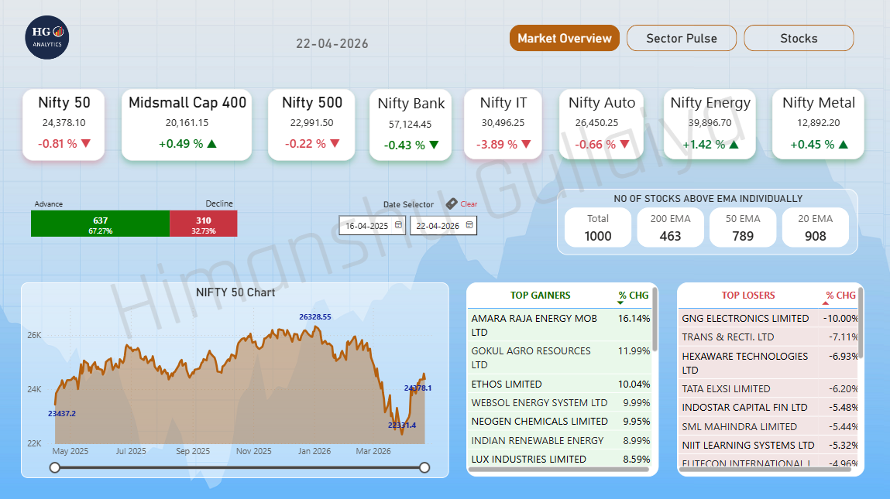
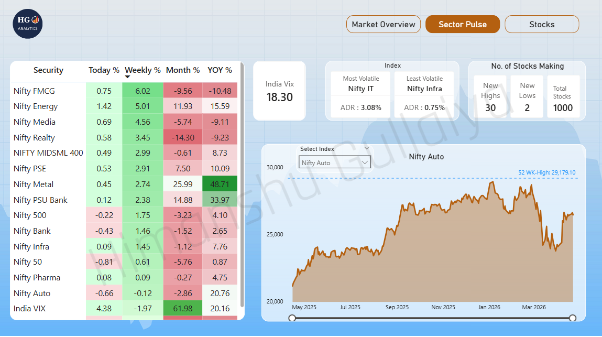
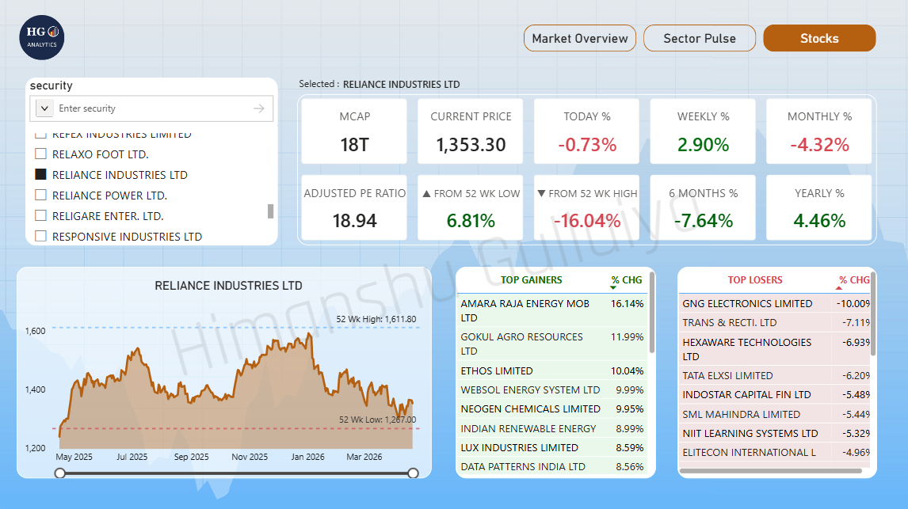

# HG Analytics — NSE Stock Market Analytics

An automated Python pipeline that downloads live NSE data daily and serves a 3-tab Power BI dashboard — Market Overview, Sector Pulse, and Stock Deep Dive.

▶ [YouTube Demo](#) &nbsp;|&nbsp; 📊 [Live Dashboard](#)

---

## Dashboard

### Market Overview


### Sector Pulse


### Stocks Deep Dive


---

## Tech Stack
`Python` &nbsp;·&nbsp; `Power BI` &nbsp;·&nbsp; `Pandas` &nbsp;·&nbsp; `DAX`

---

## Pipeline

```
NSE Website → download_data.py → parse_and_clean.py → Power BI
                                  update_daily.py (run after 3:30 PM)
```

- **download_data.py** — bulk downloads 245 days of Bhavcopy ZIPs, handles holidays and NSE date format variations
- **parse_and_clean.py** — cleans, merges PE + MCAP, filters to top 1000 stocks by market cap, computes 20/50/100/200-day MAs
- **update_daily.py** — daily EOD automation, appends new data, recalculates MAs, refreshes snapshots

---

## Dashboard Tabs

| Tab | What it answers |
|-----|----------------|
| Market Overview | How is the market today? Index cards, advance/decline, EMA breadth, Nifty 50 trend, top gainers/losers |
| Sector Pulse | Which sectors are leading? Heatmap with Today/1W/1M/YOY, sector trend chart, India VIX, volatility ranking |
| Stocks Deep Dive | How is a specific stock doing? Price, PE, MCAP, 52W position, 1W/1M/6M/1Y returns, 1-year chart |

---

## Key Design Decisions

- **Top 1000 by MCAP** — covers the full investable large + midcap universe, filters illiquid stocks that distort breadth metrics
- **EMA breadth metric** — stocks above 200/50/20 EMA gives a more meaningful signal than simple advance/decline count
- **CSV over PostgreSQL** — Python handles all transformation; CSVs feed Power BI directly with one-click refresh

---

## Project Structure

```
Trading Dashboard/
├── Scripts/
│   ├── download_data.py
│   ├── parse_and_clean.py
│   └── update_daily.py
├── DATA/
│   ├── stocks_data.csv
│   ├── indices.csv
│   ├── gainers_losers.csv
│   └── new_highs.csv
└── README.md
```

---

*Himanshu Gullaiya — Data Analyst | Python · Power BI · SQL*
